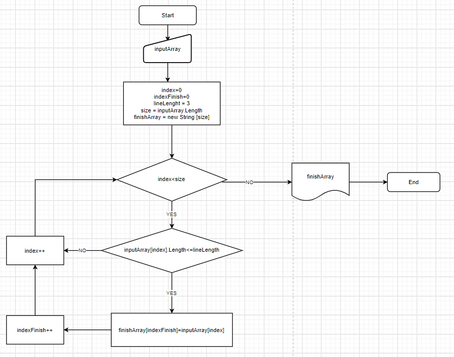

# **Задача**
Написать программу, которая из имеющегося массива строк формирует массив из строк, длина которых меньше или равна 3 символам. Первоначальный массив можно ввести с клавиатуры, либо задать на старте выполнения алгоритма. При решении не рекомендуется пользоваться коллекциями.

## Инструкция

* Введите текст, где разделителем будет ','

## Описание программы 

Программа принимает на вход введенные пользователем через консоль данные и проверяет их на соответстие условиям.
Результатом работы программы является вывод в консоль следующих строк:

* Полученные от пользователя данные.
* Данные, соответствующие условию: длина строки < 4 символов.

